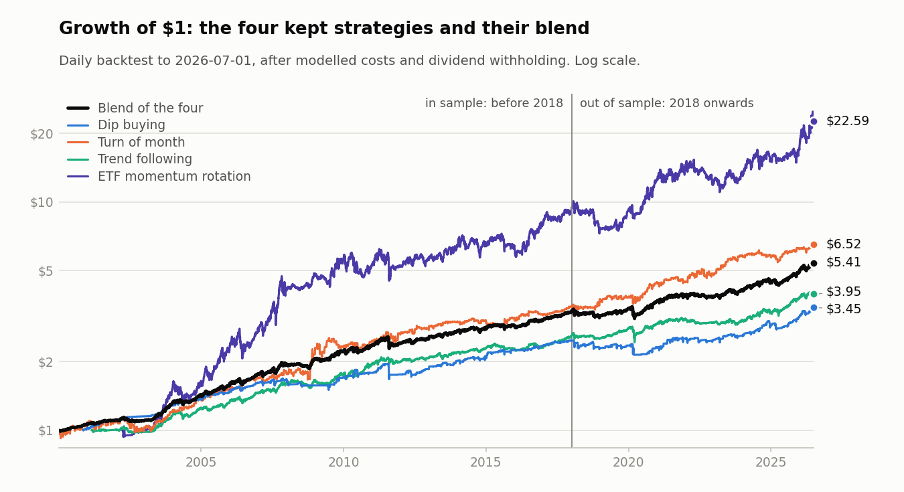
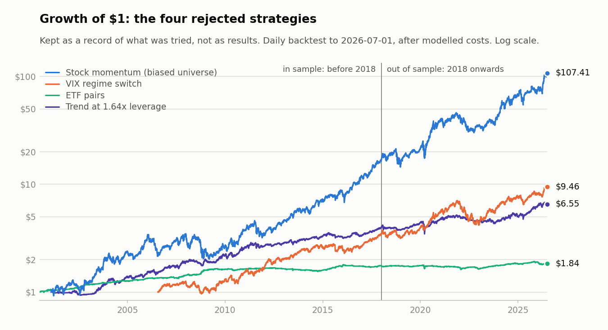
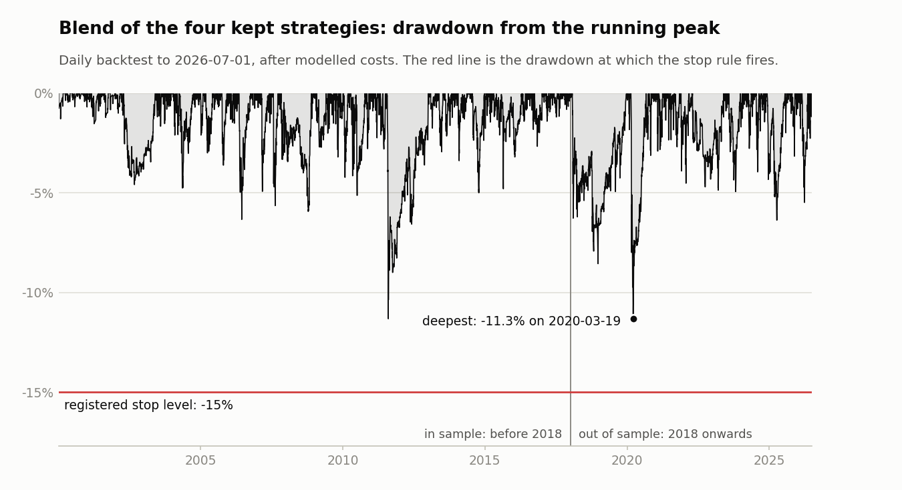
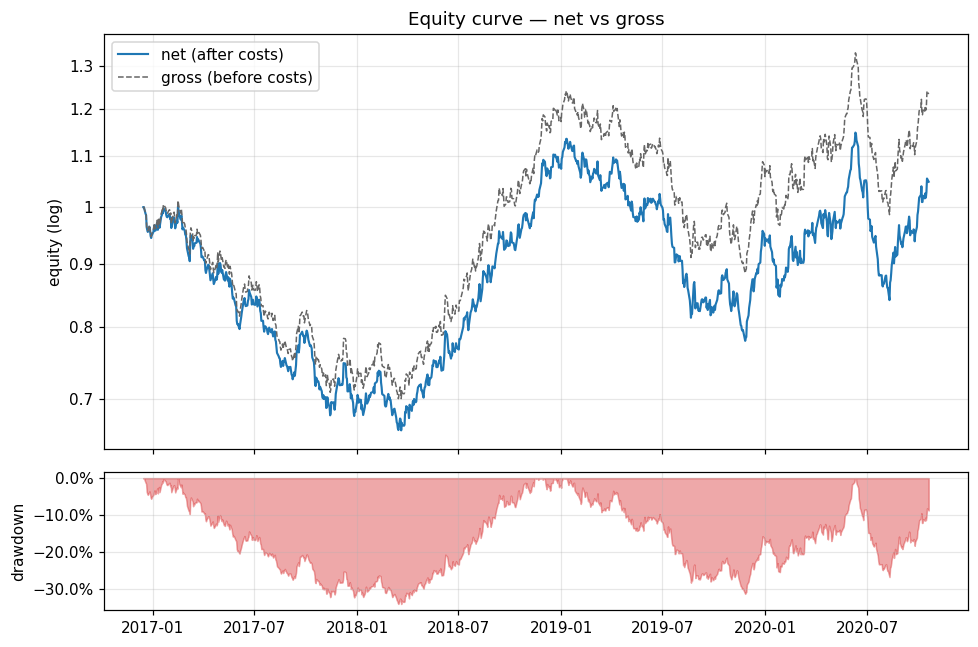

# Equity Signal Testing and Portfolio Simulation

A daily-frequency research project on US-listed ETFs and large stocks, built
end to end in Python: a data-quality gate, eight trading strategies each
documented as hypothesis, rule, variants tried and verdict, a backtest
engine with explicit costs, a four-strategy portfolio, an order sheet with
fill reconciliation, stop rules fixed in advance, and multiple-testing
statistics. Four strategies survived and four were rejected. Both groups are
published here, together with the code that produces the results on this
page. A second, configurable library, Alpha Lab, packages the same
discipline (walk-forward evaluation, an explicit execution lag, leakage
tests) for testing new signals.

**Author:** Chung Shing Mars Wong

## Results at a glance



| Strategy | Status | Sample | CAGR | Volatility | Sharpe full / in sample / out of sample | Max drawdown | Turnover | Cost drag |
| --- | --- | --- | ---: | ---: | :---: | ---: | ---: | ---: |
| Dip buying ([`mean_reversion`](src/strategies/mean_reversion.py)) | kept | 2000-11-10 to 2026-07-01 | 4.97% | 6.81% | 0.50 / 0.69 / 0.23 | -14.42% | 20.3x | 1.05% |
| Turn of month ([`seasonality_flows`](src/strategies/seasonality_flows.py)) | kept | 2000-01-03 to 2026-07-01 | 7.35% | 10.08% | 0.58 / 0.58 / 0.58 | -13.47% | 24.1x | 0.59% |
| Trend following ([`tsmom_trend`](src/strategies/tsmom_trend.py)) | kept | 2001-02-28 to 2026-07-01 | 5.58% | 6.25% | 0.64 / 0.77 / 0.42 | -14.67% | 2.0x | 0.18% |
| ETF momentum rotation ([`xsec_etf_mom`](src/strategies/xsec_etf_mom.py)) | kept | 2002-03-28 to 2026-07-01 | 13.74% | 20.86% | 0.65 / 0.74 / 0.49 | -27.85% | 5.7x | 0.26% |
| **Blend of the four kept strategies** ([`ensemble`](src/ensemble.py)) | kept | 2000-01-03 to 2026-07-01 | 6.59% | 6.35% | 0.76 / 0.90 / 0.51 | -11.33% | 12.7x | 0.72% |
| Stock momentum ([`xsec_stock_mom`](src/strategies/xsec_stock_mom.py)) | rejected | 2001-01-31 to 2026-07-01 | 20.25% | 26.18% | 0.77 / 0.75 / 0.82 | -41.79% | 13.7x | 2.51% |
| VIX regime switch ([`vol_regime`](src/strategies/vol_regime.py)) | rejected | 2006-07-24 to 2026-07-01 | 11.95% | 15.79% | 0.70 / 0.79 / 0.62 | -40.95% | 12.0x | 0.41% |
| ETF pairs ([`pairs_statarb`](src/strategies/pairs_statarb.py)) | rejected | 2000-06-30 to 2026-07-01 | 2.37% | 3.90% | 0.18 / 0.48 / -0.54 | -9.98% | 18.4x | 1.26% |
| Trend at 1.64x leverage ([`tsmom_voltarget`](src/strategies/tsmom_voltarget.py)) | rejected | 2001-02-28 to 2026-07-01 | 7.72% | 10.29% | 0.62 / 0.76 / 0.37 | -23.47% | 3.7x | 0.25% |

How to read this:

- **What survived.** Four strategies are kept and blended. The blend has a
  Sharpe ratio of 0.76 over 2000 to 2026 and a maximum drawdown of -11.3%.
  Its Sharpe ratio is 0.90 before 2018 and 0.51 from 2018, so the later
  period is clearly weaker.
- **What was rejected.** Four strategies failed and stay in the repository
  as negative results. A high number is not a pass: the stock momentum row
  has the best Sharpe ratio in the table and is rejected, because its
  universe is a list of companies that are large today.
- **The period from 2018 is not an untouched holdout.** Parameters were
  chosen on data before 2018 only, but the later period was looked at during
  development, and two default rules were revised after seeing it (the cash
  remainder in the trend strategy and the rank buffer in the ETF rotation).
- **The figures are net of modelled costs.** They are after commissions,
  fees, slippage and a 30% withholding charge on dividends, all of which are
  modelling assumptions, and they come from a backtest that assumes each
  order fills at the closing price it was decided on. They are not live
  results.

Sharpe ratios are annualised and in excess of the cash rate. Turnover is
buys plus sells per year as a multiple of capital. Cost drag is the yearly
return lost to commissions, fees and slippage. The table and the charts are
written by `python scripts/make_results_summary.py` from a price cache that
ends on 2026-07-01 (6,663 sessions). The same figures with more detail are
in [`examples/qcore/summary.md`](examples/qcore/summary.md) and
[`summary.json`](examples/qcore/summary.json). A later download gives
slightly different numbers.

## Research process

Every strategy went through the same steps, and each module's docstring
records them under the same headings (hypothesis, rule, variants tried,
selection, result, verdict).

1. **Hypothesis first.** Before any data is touched, state who is on the
   other side of the trade and why they accept the loss: forced sellers,
   scheduled month-end buyers, slow rebalancers. A pattern without such a
   reason is not tested.
2. **A variant grid fixed in advance, of at most 12.** The parameters to be
   tried and the rule that will pick among them are written into the script
   before it runs. One follow-up study, the rank buffer for the ETF
   rotation, ran 18 further variants and is counted separately; its log
   also holds 15 rows for the rejected stock rotation.
3. **Selection on in-sample Sharpe only.** The variant with the highest
   Sharpe ratio before 2018-01-01 is kept. Results from 2018 are reported
   and never used to choose. Where a default was nevertheless revised after
   later results had been seen, the docstring says so.
4. **Cost stress.** The chosen variant is re-run at higher slippage. The dip
   buying strategy is the most sensitive: its out-of-sample Sharpe ratio
   falls from 0.23 at the assumed 3 bps to 0.17 at 5 bps and 0.03 at 10 bps.
5. **Do no harm.** A change to a kept strategy is adopted only if it does
   not lose to the current rule in sample, and a tie goes to the current
   rule. The volatility-target study was rejected on this ground: no scaled
   variant matched the unscaled trend rule in sample.
6. **Every variant is logged.** Each sweep saves all of its rows to
   `results/<name>_variants.csv`, winners and losers alike. A saved log is
   never replaced silently (see [How to run](#how-to-run)).
7. **Multiple-testing deflation.** `scripts/trial_registry.py` counts the
   logged variants and reports, for each Sharpe ratio, the probability that
   it exceeds what a search of that size would produce by chance (see
   [Statistics](#7-statistics)).

Rejection is a normal outcome and gets the same write-up as a success.

## The pipeline, stage by stage

### 1. Data and the data-quality gate

- [`src/download_data.py`](src/download_data.py) builds a local cache of
  daily open, high, low, close and volume from 2000 for 51 ETFs, 50 large
  US stocks, one Treasury-bill fund and five index series (VIX, VIX3M, the
  13-week bill yield, the 10-year yield, the S&P 500), through `yfinance`.
  Adjusted and unadjusted closes come from one response, so each ex-date
  dividend can be recovered. A refresh that would lose history the cache
  already holds is refused unless `--allow-shrink` is passed.
- [`src/qcore/quality.py`](src/qcore/quality.py) and
  [`scripts/data_quality.py`](scripts/data_quality.py) are the gate: 20
  checks covering the trading calendar, missing and duplicated rows, stale
  and carried-forward prices, extreme returns that no index move confirms,
  split and dividend adjustment, volume scale, price ranges and the index
  series. The exit code is 0 (nothing to review), 1 (warnings) or 2
  (failures), so a pipeline can stop on it. A warning that has been verified
  as a real event can be listed in a file passed with `--known`, which
  records it as acknowledged.
- On the cache behind the results above (101 tickers, the ETFs and stocks
  without the Treasury-bill fund; 6,663 sessions) the gate reports no
  failure and 36 warnings. 32 of them were checked one by one and are real
  events (days without trades in young ETFs in 2000, large moves in bank
  stocks in 2008 and 2009, and the like). The other 4 concern the index
  series: two missing days at the end of June 2026 and one row on a day the
  exchange was closed.
- No market data is distributed here. For offline use,
  [`scripts/make_sample_data.py`](scripts/make_sample_data.py) writes a
  seeded, clearly labelled synthetic cache in the same layout.

### 2. Signals: the eight strategies

| Module | Idea | Rule | Verdict |
| --- | --- | --- | --- |
| [`mean_reversion.py`](src/strategies/mean_reversion.py) | A sharp fall in an ETF that is still in an uptrend is more often forced selling than news | 14 equity ETFs. Buy when RSI(2) is below 5 and the close is above its 200-day average; sell when RSI(2) is above 70 or after 10 days; at most 20% per position | **Kept.** Weakest of the four from 2018 (0.23) and the most sensitive to costs |
| [`tsmom_trend.py`](src/strategies/tsmom_trend.py) | Trends in asset classes persist because large investors adjust slowly | 14 ETFs across equities, bonds, commodities and real estate, monthly. Hold an asset when it is above its 10-month average and its 12-1 momentum is positive (half weight when only one holds), in inverse-volatility shares; the rest in cash | **Kept.** Holding cash for the remainder, in place of a short-term Treasury fund, was decided after later results had been seen |
| [`xsec_etf_mom.py`](src/strategies/xsec_etf_mom.py) | Relative strength among country and sector funds carries over for some months | 34 equity ETFs, monthly. Hold the top 3 by average 3-, 6- and 12-month return, keep a holding while it ranks 9th or better, and move to Treasuries when SPY is below its 10-month average | **Kept.** The rank buffer and month-end-only orders are a cost decision (costs fall from 0.91% to 0.26% a year), not a better signal |
| [`seasonality_flows.py`](src/strategies/seasonality_flows.py) | Salaries, pension contributions and month-end rebalancing buy on a date, not on a price | Hold SPY on the last 4 and first 2 trading days of each month, cash otherwise | **Kept.** 0.58 against 0.39 for holding SPY throughout, with a quarter of the drawdown |
| [`xsec_stock_mom.py`](src/strategies/xsec_stock_mom.py) | Investors react slowly to company news | 50 large stocks, monthly. Hold the top 5 by 12-1 momentum less a quarter of last month's return, in inverse-volatility weights | **Rejected.** The universe is today's large companies, so the backtest could only pick among eventual winners. From 2018 an equal-weight basket of the same stocks scores the same 0.82 |
| [`vol_regime.py`](src/strategies/vol_regime.py) | An inverted VIX curve marks equity stress | QQQ when the 5-day average of VIX/VIX3M is below 0.95, Treasuries above 1.05, half of each in between, with a one-session lag because the index prints after the close | **Rejected.** From 2018 it lost to simply holding QQQ (0.62 against 0.80) with a deeper drawdown |
| [`pairs_statarb.py`](src/strategies/pairs_statarb.py) | A gap between two closely related ETFs is often flow in one leg and should close | 7 pairs with a rolling hedge ratio. Enter when the spread is 2 standard deviations wide, exit at 0.5 or after 20 days | **Rejected.** Costs take the Sharpe ratio from 0.59 to 0.18, and all nine variants are negative from 2018 |
| [`tsmom_voltarget.py`](src/strategies/tsmom_voltarget.py) | Can the trend strategy run at 10% volatility without losing risk-adjusted return? | The trend rule with a volatility target, with constant 1.64x leverage, or concentrated in the assets whose signal is on | **Rejected.** No variant matched the unscaled rule in sample (0.82 against 0.76 at best), and the volatility target with a 2x cap deepened the maximum drawdown from -14.5% to -35.2% |



The rejected strategies are shown for the record. The stock momentum line is
the steepest on the chart and the least trustworthy.

### 3. Portfolio construction

[`src/ensemble.py`](src/ensemble.py) blends the four kept strategies.

- **Weights are the inverse of in-sample volatility** (data before 2018,
  with volatility floored at 2% a year), fixed once for the whole history:
  dip buying 34.2%, turn of month 19.8%, trend following 35.2%, ETF rotation
  10.9%. They are never re-estimated on later data.
- **Each strategy is costed at its share of capital.** The strategies are
  run twice. The first pass, at the full $100,000, fixes the weights. The
  second re-runs each strategy with only its share, where a $1 minimum
  commission weighs more. The blend's figures use the second pass, which
  costs 0.18% a year against running each strategy at the full amount.
- **Diversification does the work.** Daily return correlations between the
  four range from 0.23 to 0.68, and the blend's Sharpe ratio (0.76) is above
  each component's (0.50 to 0.65).
- **Caveat.** The headline resets the split between strategies at every
  close and does not charge for it. Resetting at month-ends gives 0.75, and
  never resetting gives 0.66.

### 4. Backtest and cost model

[`src/qcore/backtest.py`](src/qcore/backtest.py) and
[`src/qcore/costs.py`](src/qcore/costs.py). Everything below is a modelling
assumption, not a verified broker schedule.

- **Timing.** Weights decided from the close of day t earn the return from
  that close to the next: the engine assumes a market-on-close fill at the
  decision close. Signals from index series that print after the equity
  close are lagged one more session. The kept monthly strategies place
  orders at month-ends only and let weights drift in between; the rejected
  stock momentum re-trades to its monthly target every day.
- **Costs.** $0.005 a share with a $1 minimum and a cap of 1% of the trade,
  sell-side regulatory fees, and slippage of 2, 3 or 5 bps per side by
  liquidity tier, on $100,000 of capital.
- **Cash.** Idle cash earns the previous day's 13-week bill yield less 10
  bps. Short proceeds earn nothing. Margin interest and stock borrow are not
  charged by the engine; the two modules that need them add their own.
- **Withholding.** 30% of the dividend on each long position is charged on
  its ex-date, with Treasury funds exempt. Dividends are inferred from the
  gap between adjusted and unadjusted prices.
- **Metrics.** Sharpe ratios use returns in excess of the credited cash
  rate. Turnover counts buys plus sells. The in-sample and out-of-sample
  split is 2018-01-01.

### 5. Execution

Nothing here places an order or connects to a broker.

- [`scripts/live_targets.py`](scripts/live_targets.py) prints the order
  sheet: target shares per strategy, then one net market-on-close order per
  ticker for a person to enter. It reuses the strategy modules' own signal
  code, so the backtest and the order sheet cannot drift apart.
- **Timing gates.** A live run is refused unless the price cache ends on
  today's session and the clock is between 30 and 10 minutes before the
  close. Earlier, the snapshot is not a near-close price; later, the order
  would fill at the next close.
- **Funding and rounding.** Each strategy gets the account's equity times
  its blend weight. Orders are whole shares, rounded down per strategy, and
  the rounding gap is printed. Idle cash is parked in a Treasury-bill fund
  after reserving commissions, fees and a 25 bps price allowance. An order
  list that the cash cannot fund is refused as a whole, never trimmed.
- [`scripts/reconcile.py`](scripts/reconcile.py) compares actual fills with
  the official close and with the modelled commissions. Slippage is judged
  in dollars lost over dollars traded; more than 2 bps above the assumption
  is a breach.

The input files in [`examples/`](examples) are made up to show the format:
a ledger for the order sheet, a fills file for the reconciliation, and a
daily returns file for the monitor below.

### 6. Risk controls

[`scripts/monitor.py`](scripts/monitor.py) judges the blend's daily returns
against stop rules that were written down in advance, so that a decision to
stop is not improvised in the middle of a loss:

| Rule | Threshold | Action |
| --- | --- | --- |
| Drawdown from the running peak | below -15% | stop |
| Rolling two-year Sharpe ratio, in excess of cash | below -0.30 | stop |
| Time since the last equity peak | 32 months or more | review |
| Time since the last equity peak | 42 months or more | stop |

Moving a threshold during a loss is itself treated as a reason to stop. The
monitor refuses to give a verdict on input it cannot trust: a missing
session, a stale file, a date on which the exchange was closed.



**An honest caveat.** In the backtest the deepest drawdown is -11.3% and the
longest spell below a previous peak is 22.9 months, both inside the limits.
The two-year Sharpe rule is not: it falls to -0.64 on 2020-03-18 and is
below -0.30 on 20 sessions (February and March 2020, October and November
2023). That rule would have stopped the strategy inside its own backtest.
The thresholds are shown as they were set; whether to set them again is an
open question, not a settled one.

Other limits sit earlier in the pipeline: the data-quality gate, a cap of
150% on any single weight in the engine, and position caps, gross leverage
and a volatility target in Alpha Lab's portfolio construction.

### 7. Statistics

[`src/qcore/stats.py`](src/qcore/stats.py) implements the probabilistic
Sharpe ratio (PSR), the deflated Sharpe ratio (DSR), the expected maximum
Sharpe ratio of a search, and a block bootstrap, all tested against
independently computed values.
[`scripts/trial_registry.py`](scripts/trial_registry.py) applies them to the
saved variant logs. On the cache behind the results above:

| Series | DSR against its own 12-variant grid | PSR above zero, from 2018 |
| --- | ---: | ---: |
| Dip buying | 92.7% | 70.4% |
| Turn of month | 97.8% | 95.1% |
| Trend following | 99.7% | 86.6% |
| ETF momentum rotation | 99.5% (99.0% with the 18 buffer variants) | 91.6% |

For the blend, a block bootstrap puts the Sharpe ratio in a 95% interval of
0.42 to 1.12 over the full history and -0.08 to 1.12 from 2018, where 4.5%
of the resamples are at or below zero. The full history supports a positive
Sharpe ratio; the period from 2018 alone does not settle it.

The blend's deflated Sharpe ratio depends on how many trials are counted,
which is a judgment call. The nine sweeps published here log 123 variants.
Counting each sweep as one trial gives 98.4%, and counting every variant
gives 82.8%. Both are too generous: the research behind this project tried
more ideas than are published, most of them rejected. Over that full
history, roughly 470 logged variants in about 50 sweeps, the same two
figures are about 88% to 89% and about 63%.

## Alpha Lab

[`alpha_lab/`](alpha_lab) is the configurable library. A run is described by
one YAML file: data source, features, signal, portfolio construction, cost
model and walk-forward windows. Components are registered by name, so a new
signal needs a class and a config, not a new backtest. See its
[README](alpha_lab/README.md), the
[timing conventions](alpha_lab/CONVENTIONS.md) and the
[quickstart notebook](alpha_lab/notebooks/01_quickstart.ipynb).

- **Execution timing is explicit.** The default lag is two daily rows: a
  target computed after Monday's close trades at Tuesday's close and first
  earns Wednesday's return. Costs use prices and liquidity estimates known
  at the time of the trade.
- **Tests plant the errors they look for.** The suite plants look-ahead in
  features, signals, portfolio construction and cost inputs, a gap between
  training and test windows that is too short, and holdings outside the
  universe, and requires each to be caught, next to clean controls that must
  pass. The same checks are importable (`alpha_lab.testing.checks`) for use
  on a new signal.
- **Runs are inspectable.** Each run saves its resolved configuration,
  library versions, result tables, metrics and an HTML and Markdown report.



The example uses generated prices with a fixed seed: 20 assets, 12-1
momentum, a long-short portfolio of the top and bottom fifth, eight rolling
walk-forward windows. It demonstrates the pipeline, not a profitable
strategy: the Sharpe ratio is 0.37 before costs and 0.16 after, with costs
of 4.1% a year. Only the walk-forward test period is plotted. The full
[sample report](examples/synthetic_report.md) is viewable on GitHub, and the
[HTML version](examples/synthetic_report.html) can be downloaded and opened
in a browser.

## How to run

Python 3.11 or 3.12. From the repository root:

```bash
python3 -m venv .venv
source .venv/bin/activate
python -m pip install -r requirements.txt
python -m pytest
```

### Alpha Lab example (offline)

```bash
python alpha_lab/scripts/run_backtest.py --config alpha_lab/configs/base.yaml
python alpha_lab/scripts/make_report.py --run alpha_lab/runs/<run_id>
```

The first command prints the run directory under `alpha_lab/runs/` and the
metrics; the second rebuilds the report of an existing run. With the default
configuration the Markdown report is identical to
[`examples/synthetic_report.md`](examples/synthetic_report.md).

### The market-data pipeline on the synthetic sample (offline)

The sample cache is simulated. It exercises every command; the figures it
produces mean nothing.

```bash
python scripts/make_sample_data.py
export QCORE_DATA_DIR="$PWD/sample_data"

# 1. data-quality gate
python scripts/data_quality.py

# 2. the four kept strategies, then 3. the blend
mkdir -p results
for key in mean_reversion seasonality_flows tsmom_trend xsec_etf_mom; do
  python "src/strategies/$key.py" > "results/$key.json"
done
python src/ensemble.py

# 5. order sheet for the sample's last session, and the fills check
python scripts/live_targets.py --as-of 2021-12-31 --cash 5000 \
    --ledger examples/ledger.example.csv --ignore-ledger-date
python scripts/reconcile.py examples/fills.example.csv

# 6. stop rules: on the blended backtest, and on a returns file
python scripts/monitor.py --backtest
python scripts/monitor.py examples/live_returns.example.csv --as-of 2025-03-31

# results table and charts (kept inside sample_data/, which Git ignores)
python scripts/make_results_summary.py --out sample_data/summary
```

The rejected strategies, the selection sweeps and the trial registry:

```bash
python src/strategies/xsec_stock_mom.py
python src/strategies/vol_regime.py
python src/strategies/pairs_statarb.py
python src/strategies/tsmom_voltarget.py

python research/mean_reversion_sweep.py
python src/strategies/seasonality_flows.py --sweep
python src/strategies/tsmom_trend.py --sweep
python src/strategies/xsec_etf_mom.py --sweep
python research/rank_hysteresis_sweep.py
python scripts/research_pairs_statarb.py
python scripts/xsec_stock_mom_sweep.py
python src/strategies/vol_regime.py --sweep
python scripts/trial_registry.py
```

`QCORE_DATA_DIR` names the cache that every loader reads, and a loader says
so on stderr when it is set; without it the cache is `data/`. The gate
writes its report to `data_quality.json` inside such a cache, and to
`results/data_quality.json` for the default one. Each script's docstring
lists its options and exit codes, and a script that lacks an input says
which command creates it.

### Market data (optional, needs a network connection)

```bash
unset QCORE_DATA_DIR
rm -rf results
python src/download_data.py
python scripts/data_quality.py
```

Then run the same commands as above, with the last date of the downloaded
cache for `--as-of`. `python scripts/make_results_summary.py` without `--out`
rewrites `examples/qcore/` from your download. The download goes through
`yfinance`; it can be rate-limited or revised by the provider, and the data
must be obtained under the provider's terms. Expect the gate to exit with
warnings (exit 1) on market data, like those in
[stage 1](#1-data-and-the-data-quality-gate), and review what it reports
before reading any result; exit 2 means stop. A close that stays flat for
weeks is a failure for an ordinary ticker but only a warning for a
Treasury-bill fund: SGOV, where the order sheet parks idle cash, printed the
same close for 11 to 13 sessions three times in 2020.
`rm -rf results` matters: records computed from the sample must not be mixed
with records from market data.

### Saved records are protected

Files under `results/` are records: a variants log is the denominator of a
trial count, and a metrics file may be what an earlier conclusion rests on.
Scripts therefore never replace one silently
([`src/qcore/records.py`](src/qcore/records.py)):

- no file yet: it is written;
- same content: it is left alone;
- different content: the saved file is kept and the new output goes to
  `results/recomputed/`, with a message saying so;
- `--rebase` (or `QCORE_REBASE=1`) replaces the saved file. That is a
  deliberate act, not a default.

## Limits

- **Execution at the decision close.** The backtests assume an order
  decided from a closing price fills at that same price. The final close is
  not known before the market-on-close deadline, so in practice orders are
  sized on a near-close snapshot. `scripts/reconcile.py` measures that gap
  on real fills; the backtest does not model it. Alpha Lab's default lag
  avoids the problem by trading one day later.
- **No untouched holdout.** The period from 2018 was inspected during
  development and two defaults were revised after seeing it. Treat
  "out of sample" as "not used by the selection rule", nothing stronger.
- **Fixed grids, without proof of timing.** The grids and selection rules
  were set before the runs, but the repository holds no timestamped record
  of that. It is the author's working rule, not an independently verifiable
  registration.
- **Survivorship.** The stock universe is a fixed list of companies that are
  large today, which is why the stock strategy is rejected. The ETF lists
  are also today's funds: funds that closed are absent. The data provider
  supplies neither historical index membership nor a complete record of
  delisted names.
- **Costs are assumptions.** Commissions, fees, slippage, the cash yield and
  dividend withholding are fixed model parameters, not a current broker
  schedule or tax accounting. No tax other than dividend withholding is
  modelled. Costs are computed for $100,000 of capital, and nothing here is
  a capacity estimate.
- **Share counts and dividends are inferred.** Commissions use a
  split-adjusted close, so stocks with large later splits are overcharged
  in early years (up to the 1% cap) and reverse splits are undercharged.
  Dividends come from the gap between adjusted and unadjusted prices, so
  special distributions and spin-off adjustments are charged withholding
  like ordinary dividends, and rounding in the vendor's adjusted prices
  leaves a few spurious payouts of about two millionths of the price.
- **The blend's weights are fixed and its re-split is free.** The weights
  come from in-sample volatility and are never re-estimated. Moving capital
  between strategies is not costed in the headline.
- **The stop rules were calibrated on an earlier backtest.** One of them
  fires inside the current one (see [Risk controls](#6-risk-controls)).
- **Trial counts are a lower bound.** The registry can only count the logs
  it is given.
- **One data vendor.** Prices come from a free source that revises history.
  The cache behind the results is not distributed, and a new download will
  not reproduce them to the last digit. The gate flags suspect data; it
  does not prove the data correct.
- **Tests check behaviour, not profitability.** They pin the accounting,
  the timing, the rules and known failure cases. Passing them says nothing
  about future returns or the absence of every research bias.

## Code map

```text
src/qcore/                  engine: backtest, costs, calendar, data loading,
                            data-quality checks, saved-record guard, statistics
src/strategies/             the eight strategies (four kept, four rejected)
src/ensemble.py             the four-strategy blend
src/download_data.py        optional market-data downloader
scripts/data_quality.py     data-quality gate
scripts/make_sample_data.py synthetic sample cache
scripts/live_targets.py     order sheet
scripts/reconcile.py        fills against the cost and slippage assumptions
scripts/monitor.py          stop rules
scripts/trial_registry.py   trial count, deflated Sharpe ratios, bootstrap
scripts/make_results_summary.py
                            the table and charts in examples/qcore/
research/                   selection sweeps: dip buying grid, rank-buffer study
scripts/research_pairs_statarb.py, scripts/xsec_stock_mom_sweep.py
                            selection sweeps of two rejected strategies
tests/                      engine accounting, strategy rules, look-ahead,
                            calendar, data quality, execution, stop rules,
                            statistics, the pipeline on the sample cache
alpha_lab/alpha_lab/        library: data, features, signals, portfolio,
                            backtest, risk metrics, experiments, reports
alpha_lab/configs/          example configuration
alpha_lab/scripts/          run and report commands
alpha_lab/tests/            unit, timing, leakage and bias tests
alpha_lab/notebooks/        quickstart notebook
examples/                   synthetic Alpha Lab report, made-up input files
examples/qcore/             results table and charts from market data
```

## Validation

1535 tests collected. In clean environments they were run on Python 3.12
with pandas 2.3 and with pandas 3.0, and on Python 3.11 with the lowest
versions that `requirements.txt` allows: in each, 1534 pass and 1 is skipped
(it needs `pyarrow`, which is not a requirement). With `pyarrow` installed,
three more parametrised cases are collected and nothing is skipped. SciPy is
not required.

Every command in [How to run](#how-to-run) was run from a fresh clone on
Python 3.12, except the live download of market data. The downloader is
tested offline against simulated responses; a live download is not part of
the automated checks. One manual download of the full list was checked
separately: the strategies, the blend, the order sheet and the monitor ran
on it, and the gate's only failures were the three flat stretches in the
Treasury-bill fund that it now reports as warnings.

The GitHub workflow runs the tests, the offline example (comparing its
report with `examples/synthetic_report.md`) and the sample-cache pipeline on
Python 3.11 and 3.12, plus one job on the minimum versions.

## Licence

Released under the [MIT License](LICENSE).
